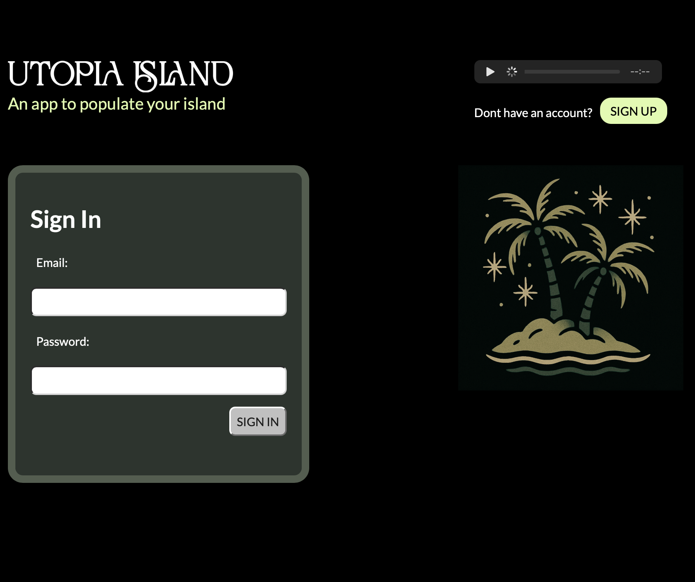

# Utopia Island

<h2 style="text-decoration: none; border-bottom: none; margin-top: -20px">An app to populate a fantasy island with celebrities from the past and present. </h2>

### [Click here to view Utopia Island](https://diadiaspora.github.io/Food-Lady-Game/)
### Username: Guest Password: Guest

## Dia Diaspora | 2025  

 

## Description

### * The user is intitially has 10 suggested celebrity citizens on their island. 
### * They can delete them or edit their roles in society.
### * They can add additional citizens. There is  a limit of 20 citizens. 
### * Celebrity citizens can be from past or present
### * Celebrity citizens can be fictional or non fictional

## Table of Contents
* [Technologies Used](#technologiesused)
* [Features](#features)
* [Design](#design)
* [Project Next Steps](#nextsteps)
* [Deployed App](#deployment)
* [About the Author](#author)

## Features
* User Authetication
* Data 

## Technologies Used

 
 
 	
  
 
 
 
 
 
 

## Trello Planning
* Link to trello or planning board - ex: https://trello.com/b/2jeHdFcV/project-1-connect-4

